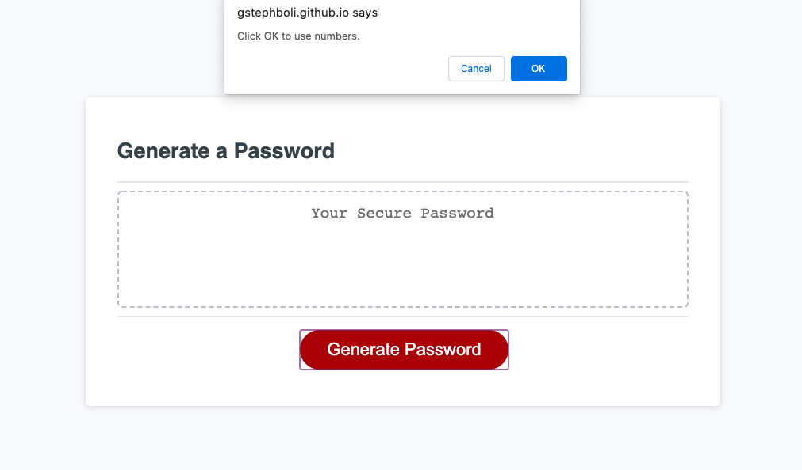
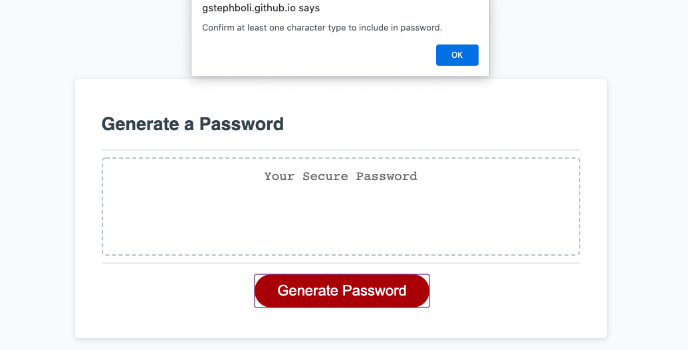

# password-generator

This project was very challenging for me. I had to do a lot of research to look through where to begin the process of writing out the javascript. From the beginning, setting the variable took me awhile to figure out. I could not understand why I couldn't just set var upperCase and then assign the alphabet to it, same with the rest of the variables. After doing an extensive search on google and seeing other peoples ideas on Stack Overflow, I realized that I would need to make them separate variables, assigning the alphabet or special characters or numbers to a CharString instead of the single variable it self, because the password that would be generated would be a string. 

Originally I had set the basic variable and prompts or confirms, just to have an idea of what it was that each part needed for when I went back to write my if/else statements. The section that took me the longest was asking the user to set the character count they wanted. Once discovering that I would need to set a while loop and within the while loop tell it that the number needed to a) be an actual number and b) an integer. Once I set up the while loop the rest of the if/else statements were straightforward enough to write. 

The last part that I struggled with was setting up the for loop to provide the final password string. I just was not sure what variables needed to go in there to get the math.floor and math.random to work how I needed it to. Was able to discuss with a few classmates their approaches and after a bit of trial and error, was able to get the finished product and get the password to generate. 

## Installation

Fork repository at https://github.com/gstephboli/password-generator .

Clone repository to local terminal.

Open HTML then open webpage to default browser.

Happy editing!

## Usage

This [website] (https://gstephboli.github.io/password-generator/) allows for a user to be able to generate a password. They are able to choose characters as low as 8 and no higher than 128. Then they are able to choose the parameters of the kind of password they want choosing from upper and lower case, special characters and numbers. 

## Credits

I credit the following websites:

Help in discovering the use of null [MozillaWebDocs] (https://developer.mozilla.org/en-US/docs/Web/JavaScript/Reference/Global_Objects/null) .

Discovering the use of NaN [MozillaWebDocs] (https://developer.mozilla.org/en-US/docs/Web/JavaScript/Reference/Global_Objects/NaN)

Getting started on how to name certain variables and if/else statements [StackOverFlow] (https://stackoverflow.com/questions/24857893/password-requirements-program) & [StackOverFlow] (https://stackoverflow.com/questions/1497481/javascript-password-generator).

Understanding the use of While Loops [w3schools] (https://www.w3schools.com/js/js_loop_while.asp) .

## Contact

####  **Stephany Bolivar** 
*  **Github:** [@gstephboli](https://github.com/gstephboli)
*  **Email:** [g.stephanybolivar@gmail.com](g.stephanybolivar@gmail.com)

## License

MIT License

Copyright (c) [2020] [Gloria Stephany Bolivar]

Permission is hereby granted, free of charge, to any person obtaining a copy
of this software and associated documentation files (the "Software"), to deal
in the Software without restriction, including without limitation the rights
to use, copy, modify, merge, publish, distribute, sublicense, and/or sell
copies of the Software, and to permit persons to whom the Software is
furnished to do so, subject to the following conditions:

The above copyright notice and this permission notice shall be included in all
copies or substantial portions of the Software.

THE SOFTWARE IS PROVIDED "AS IS", WITHOUT WARRANTY OF ANY KIND, EXPRESS OR
IMPLIED, INCLUDING BUT NOT LIMITED TO THE WARRANTIES OF MERCHANTABILITY,
FITNESS FOR A PARTICULAR PURPOSE AND NONINFRINGEMENT. IN NO EVENT SHALL THE
AUTHORS OR COPYRIGHT HOLDERS BE LIABLE FOR ANY CLAIM, DAMAGES OR OTHER
LIABILITY, WHETHER IN AN ACTION OF CONTRACT, TORT OR OTHERWISE, ARISING FROM,
OUT OF OR IN CONNECTION WITH THE SOFTWARE OR THE USE OR OTHER DEALINGS IN THE
SOFTWARE.